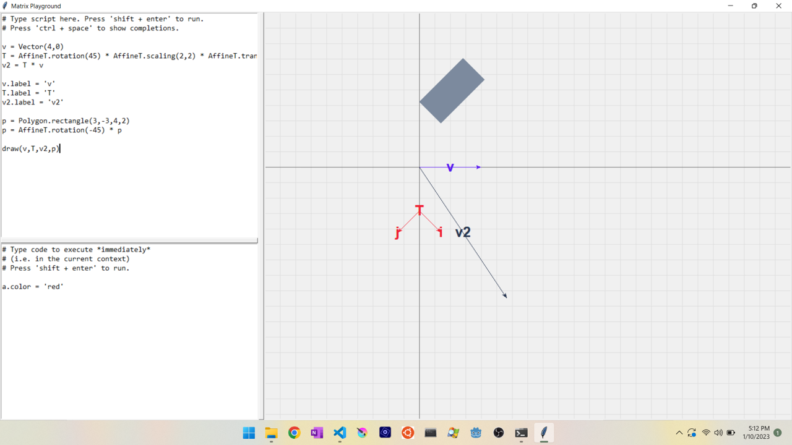

# Matrix Playground

Interactively play with/visualize matrices, vectors, points, transformations, etc.

See `quickreference.py` for the cheatsheet.

If you just wanna use it, go to the releases and download the installer, you don't need to read the rest of this document.

If you wanna edit/build it, read on.

# Dependencies
- python 3
- tkinter
- numpy
- jedi

# Architecture
The functionality is split into a bunch of classes. Generally 1 class per file (file has same name as class).
- `CodeEditor` represents basically the left side of the gui (where you type code and press shift + enter to run it)
- `CommandInterpretter` represents the thing that executes code typed in the CodeEditor (and also draws visual representations on a tkinter canvas). Basically the right side of the screen.
- `Completions` is an autocomplete widget (a widget is a tkinter GUI element)
- `config.py` doesn't have a class, but contains program-wide (not just module-wide) globals
- `Gui` represents the GUI as a whole (the code editor and the command interpretter)
- `MathObject` is the base class of all things you can create (Vectors, Points, Polygons, matrices, etc)
- `Vector` - a 2d vector
- `Point` - a 2d point
- `Polyline` - a sequence of connected points
- `Polygon` - like Polyline, but closed (i.e. last point is connected to first)
- `LinearT` - represents a 2d linear transformation (i.e. does not have a translation component)
- `AffineT` - represents a 2d affine transformation (i.e. *does* have a translation component)

# Building
- need the dependencies noted above as well as `pyinstaller` installed
- run `create_installer.py` to create a standalone installer that you can distribute (this script uses pyinstaller first to create a standalone folder, then makes an installer from that folder)

# Acknowledgements
Thanks to python, jedi (python smart autocomplete library), vscode, and anaconda for making developing this easy.
