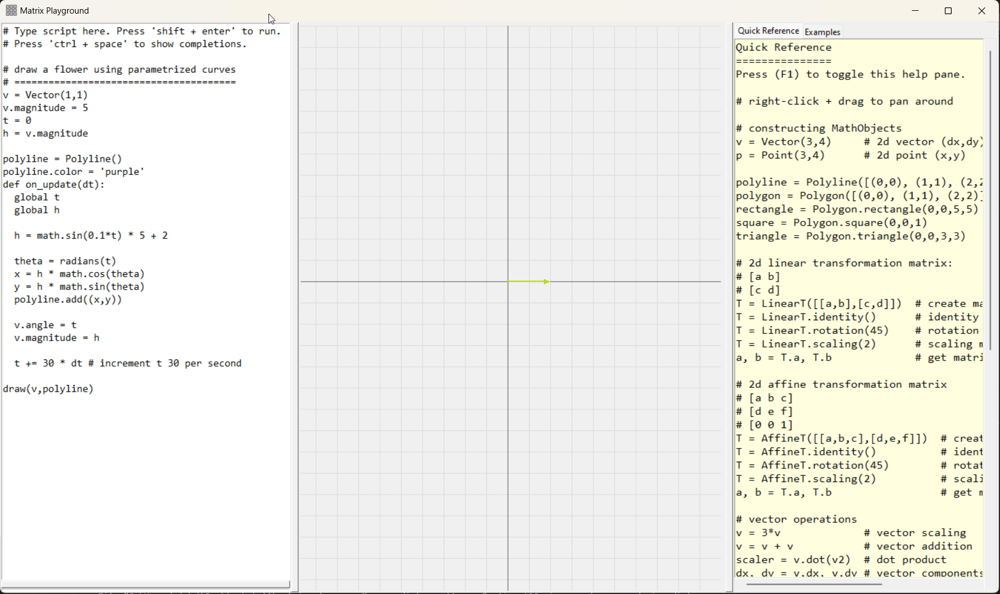

# Matrix Playground

Interactively play with/visualize matrices, vectors, transformations, points, polygons, circles, etc. Can run a function periodically to animate things.

If you just wanna use it, go to the [releases](https://github.com/MeLikeyCode/matrix_playground/releases) and download the installer. Once installed/launched, read the quick-reference/examples pane on the right of the application's window to learn how to use it.

You don't need to read the rest of *this* document unless you want to develop/build the application itself.

# Dependencies
- python 3
- numpy
- jedi (used for autocomplete)

# Architecture
The functionality is split into a bunch of classes. Generally 1 class per file (file has same name as class).
- `CodeEditor` represents basically the left side of the gui (where you type code and press shift + enter to run it)
- `CommandInterpretter` represents the thing that executes code typed in the CodeEditor (and also draws visual representations on a tkinter canvas). Basically the right side of the screen.
- `Completions` is an autocomplete widget (a widget is a tkinter GUI element)
- `Help` is a widget that displays a quick reference and examples (toggled by pressing f1)
- `QuickReference` is a widget that displays the quick reference
- `Examples` is a widget that displays example code
- `config.py` doesn't have a class, but contains program-wide (not just module-wide) globals
- `utilities.py` doesn't have a class, but contains utility functions that the *end-user* can use (e.g. `random_color()`)
- `Gui` represents the GUI as a whole (the code editor and the command interpretter)
- `MathObject` is the base class of all things you can create (Vectors, Points, Polygons, matrices, etc)
- `Vector` - a 2d vector
- `Point` - a 2d point
- `Polyline` - a sequence of connected points
- `Polygon` - like Polyline, but closed (i.e. last point is connected to first)
- `LinearT` - represents a 2d linear transformation (i.e. does not have a translation component)
- `AffineT` - represents a 2d affine transformation (i.e. *does* have a translation component)

# Building an Installer
- need the dependencies noted above as well as `pyinstaller` and `NSIS` installed
- run `create_installer.py` to create a standalone installer that you can distribute
  - This script uses pyinstaller first to create a standalone folder, then makes an installer from that folder using NSIS. The installer is called `install_matrix_playground.exe` and is place at the root of the project folder.

# Acknowledgements
Thanks to python, jedi (python smart autocomplete library), and NSIS for making creating this easy(ish).
